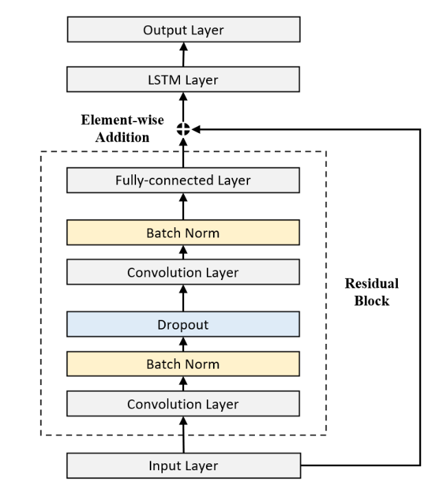

# StockPricePrediction
Kết hợp 2 mô hình RESNET và LSTM để dự đoán

Ý tưởng bài toán : Dựa tren bài báo : ResNLS: An Improved Model for Stock Price Forecasting

Kết hợp ResNet và LSTM để dự đoán giá Close(T+1), trong đó ResNet (CNN) trích xuất đặc trưng xu hướng giá, còn LSTM học quan hệ chuỗi thời gian, giúp cải thiện độ chính xác so với mô hình đơn lẻ. 

Input: là một chuỗi giá đóng cửa (Close) trong 10 ngày gần nhất.

Output: là T+11
